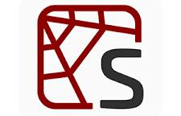

<h1 align="center">Hola, mi nombre es Alejandra Beato Hiciano 💖</h1>

## Sobre mi:

 Empecé en la Programación a mediados del 2018 al empezar a estudiarlo en un politécnico y desde entonces sigo estudiando para poder tener más conocimientos al respecto. Hasta la actualidad solo ando utilizo Python, a menos que sea necesario utilizo otros Lenguajes de Programación.

## Tecnologías:

#### Lenguajes de Programación y Frameworks:
  
  
 

#### Base de Datos:
  

#### Herramientas:
  
  
  
  
  

#### Sistemas Operativos:
  
  

## Contacto:
  
  
  
  
